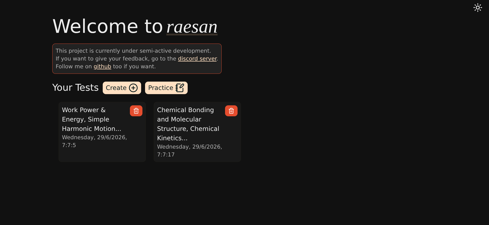
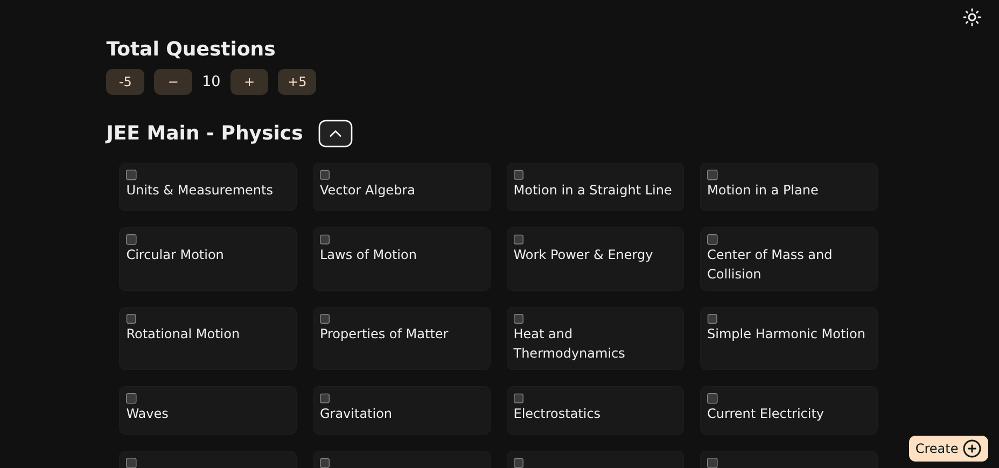
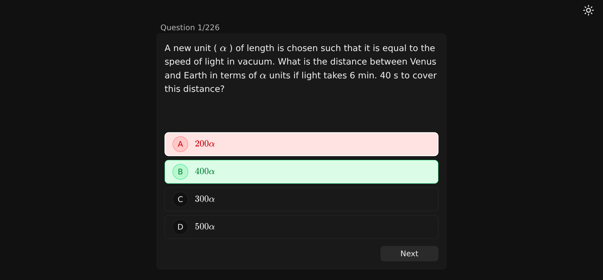

# raesan

> _Pronounced the same as "reason" (intentionally misspelled)._

- [https://raesan.enthalapy.com](https://raesan.enthalapy.com)

A free and open-source, high-performance exam preparation platform tailored for JEE and NEET aspirants. **raesan** provides a seamless environment for students to create custom tests, practice subject-wise questions, and simulate real exam conditions.

Click the image below to open the demo video on youtube.

## Tech Stack

- **Frontend:** SvelteKit, TypeScript, Tailwind CSS
- **Backend & Database:** Rust, Sqlite
- **Deployment & Hosting:** Docker, Nix/NixOS, Render

## Screenshots

### Custom Test Creation

Build tailored practice tests by selecting specific subjects and chapters from multiple exams.

### Interactive Practice Interface

A distraction-free exam environment featuring robust state management and navigation.

